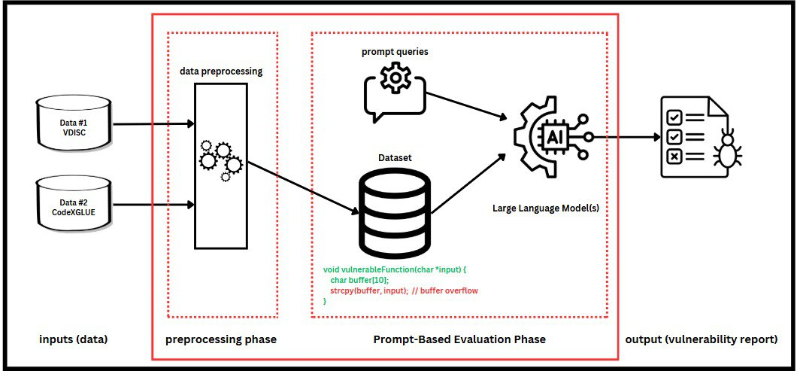

# 🔐 Prompt-Based LLMs for Software Vulnerability Detection

This repository presents a lightweight, structure-agnostic framework to evaluate the capability of Large Language Models (LLMs) in detecting software vulnerabilities directly from **raw source code**, without relying on structural representations such as AST, CFG, or DFG.

---

## System Architecture



The proposed system consists of two main phases:

### 1. **Preprocessing Phase**
- Input datasets: 
  - `VDISC`: Annotated with CWE categories (e.g., CWE-119, CWE-476)
  - `CodeXGLUE`: Labeled with binary vulnerability classes
- Tasks:
  - Normalize code syntax
  - Convert CWE labels to binary form (`vulnerable` / `non-vulnerable`)
  - Tokenize and unify samples into structured JSON format
  - Output directory: `output_jsons/`

### 2. **Prompt-Based Evaluation Phase**
- Uses handcrafted prompts to simulate expert-level vulnerability reasoning
- Each function is analyzed by an LLM (e.g., GPT-4, Falcon, Gemini) via API
- The model predicts whether a function is vulnerable (1) or not (0)
- A final report is generated showing accuracy and misclassified samples

---

---

## How to Run

1. Install dependencies:

```bash pip install openai tqdm```

2. Add your OpenAI API key to the script (if using gpt-4-turbo):
   
```API_KEY = "sk-..."  # Add your key in dataEvaluator.py```

3. Place preprocessed JSON dataset(s) inside the output_jsons/ directory


4. Run the evaluator:

 ```python dataEvaluator.py ```


